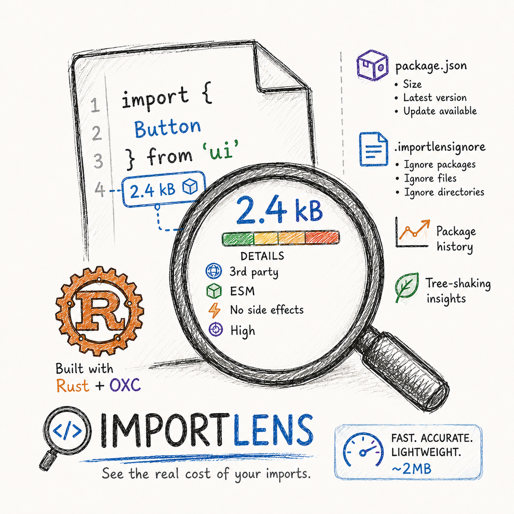

<div align="center">
    <h1>Import Lens</h1>
    <strong>A blazingly fast Visual Studio Code extension that displays the real-world post-bundle cost of your npm imports directly inline as you type.</strong>
    <br>
    <br>
    
</div>

Unlike existing import cost calculators that spin up heavy Node.js bundlers, Import Lens offloads all computation to a highly optimized background Rust daemon built on **Rolldown** and the **OXC** (Oxidation Compiler) toolchain. It performs real bundler-grade tree-shaking, minification, and compression in milliseconds without blocking your editor or consuming massive amounts of memory.

**Everything runs locally.** Your source code never leaves your machine. The only optional network access is a bounded npm registry lookup for `package.json` version hints, and you can turn that off with one setting.

---

<div align="center">

[**Quick Start**](#quick-start) &nbsp;•&nbsp; [**Reading the Hints**](#reading-the-hints) &nbsp;•&nbsp; [**package.json Guidance**](#packagejson-dependency-guidance) &nbsp;•&nbsp; [**Reports & Budgets**](#workspace-reports--budgets)

[**Commands**](#commands) &nbsp;•&nbsp; [**Configuration**](#configuration) &nbsp;•&nbsp; [**How It Works**](#how-it-works)

</div>

## Highlights

- ⚡ **Instant Feedback:** See post-tree-shake, minified, and compressed (Gzip, Brotli, Zstd) sizes inline as you type.
- 🌳 **Real Tree-shaking:** Calculates sizes for named, default, namespace, dynamic imports, re-exports, and named export candidates, not naive whole-package estimates.
- 🦀 **Rust Daemon Engine:** [Rolldown](https://rolldown.rs/) (built on OXC) links and tree-shakes the module graph; direct OXC (`oxc_parser`, `oxc_resolver`, `oxc_semantic`, `oxc_minifier`) parses your document, resolves packages, validates, and minifies, with parallel Rust compression. Long jobs like registry lookups and workspace reports run on isolated worker pools so typing feedback never waits in line.
- 🧩 **Multi-Framework Support:** JavaScript, TypeScript, JSX/TSX, `.mts`/`.cts`, Svelte (`<script>` blocks), Astro (frontmatter and client scripts), and Vue (`<script>` / `<script setup>` blocks).
- 📦 **package.json Guidance:** Dependency rows show measured install cost plus npm registry hints (`latest`, `update 19.0.0`, `install 19.0.0`, deprecation flags), with clear stale-data indicators when the registry is unreachable.
- 📈 **Impact Insights:** Confidence levels, working-tree import cost deltas (`+2.1 kB br` on changed lines), per-import history trends, current-file totals, shared dependency explanations, and barrel re-export warnings.
- 🛠️ **Import Actions:** Tree-shaking CodeActions, curated substitution suggestions, diagnostic copy actions, named export candidates and completions. Every action copies to the clipboard; nothing rewrites your source.
- 📊 **Workspace Reports & Budgets:** A daemon-generated whole-workspace report (sorted rows, duplicate imports, shared modules, SVG treemap), per-import/per-file Brotli budgets as editor diagnostics, and an `importlens check` CLI for CI.
- 💾 **Persistent Caching:** In-memory and per-project disk shards (`papaya` + `redb`) with startup prewarm, LRU size limits, and one-command cache management.
- 🎨 **Flexible UI:** Confidence-colored inline hints by default, with native accessible Inlay Hints, end-of-line decorations, and CodeLens as alternatives.
- 🪶 **Runtime-Aware Results:** Declaration-only packages report zero runtime bytes, framework virtual modules are skipped, and conservative CJS or fallback paths surface structured diagnostics instead of silently failing.

## Quick Start

1. **Install Import Lens** from the VS Code Extensions view, or install the `.vsix` directly (`Extensions: Install from VSIX…`).
2. **Check the requirements:** VS Code **1.90+** and a workspace (or loose file) whose parent tree contains a populated `node_modules` directory.
3. **Open any supported file** and sizes appear inline next to each npm import within milliseconds:

   ```ts
   import { debounce } from "lodash-es";   //  1.2 kB br
   import moment from "moment";            //  72.1 kB br
   ```

4. **Hover an import** for the full breakdown: minified/gzip/brotli/zstd sizes, confidence reasons, module contributions, shared-byte explanations, included-asset rows, and copyable diagnostics.
5. **Open `package.json`** to see per-dependency install cost and registry hints on every dependency row.
6. **Explore the command palette** by typing `Import Lens:` to find reports, comparisons, history, and cache tools ([full list below](#commands)).

## Reading the Hints

Every label is designed to be understood at a glance:

| Label         | Meaning                                                                      |
| ------------- | ---------------------------------------------------------------------------- |
| `12.4 kB br`  | Post-tree-shake, minified, Brotli-compressed cost of this exact import.      |
| `~1.6 kB br`  | Low-confidence estimate, marked with a leading `~`. Hover for the reasons.   |
| `+2.1 kB br`  | Working-tree delta: this import was added/changed in your current Git diff.  |
| `over budget` | The import exceeds your configured Brotli budget.                            |
| `types only`  | Declaration-only package with zero runtime bytes.                            |
| `checking…`   | Analysis in progress (results stream in per import).                         |
| `unavailable` | Size could not be determined. Hover and use **Copy diagnostics** to see why. |

**Confidence colors** (default renderer): high confidence uses a muted success color, medium uses amber, low uses red. Prefer VS Code's screen-reader-accessible rendering? Set `importLens.inlineRenderer` to `native`.

### The number is not only JavaScript

A package ships more than its code, so the inline number includes it. If a package's entry imports a
stylesheet, a wasm module, or a font, those bytes are measured the way they actually ship — the
stylesheet's `@import` tree is resolved and minified into one CSS file, binaries are taken as-is —
and **each file is compressed on its own** before the sizes are added together. That last part
matters: separate files ship separately, so compressing them as one blob would report a number no
browser ever downloads.

Hover shows an **Included assets** section breaking the total down by kind, so you can see that a
40 kB UI kit is 4 kB of JavaScript and 36 kB of CSS.

Some shipped bytes are disclosed instead of counted, and the hover always says which:

| You'll see | What it means |
| --- | --- |
| An **Included assets** row | Those bytes are already inside the number. |
| *"…does NOT include them"* | Real shipped bytes the tool could not process or does not count — an image referenced from CSS, an unreadable file, a preprocessor source. The number is a **floor**: the true cost is higher. Confidence drops to medium. |
| *"…this size reads HIGH"* | The stylesheets could not be combined, so each was measured alone and bytes they share were counted more than once. The number is an **upper bound**, and budgets are not evaluated against it. |
| *"…fetched at runtime"* | The CSS pulls something from a CDN (a web font, a remote sheet). That is real weight for your page but not bytes this package ships, so the number stays exact — only confidence drops. |

A package with nothing to disclose keeps high confidence. Medium confidence here is not a warning
that something is broken; it is the tool declining to present a number as more complete than it is.

**Display modes** (`importLens.display`):

| Mode                    | Shows                                                            |
| ----------------------- | ---------------------------------------------------------------- |
| `inlayHint` *(default)* | Inline hint right after the import, colored or native.           |
| `minimal`               | Compact end-of-line decoration with the primary compressed size. |
| `standard`              | Primary compressed size plus minified size.                      |
| `verbose`               | Brotli, gzip, zstd, and minified sizes together.                 |

## package.json Dependency Guidance

Open any `package.json` and Import Lens annotates dependency blocks as results stream in:

- **Install cost** per dependency, measured with the same tree-shaking pipeline, plus per-block summaries.
- **Version status** from the npm registry: `latest` when you're current, `update 19.0.0` when newer exists, `install 19.0.0` for missing packages, and a deprecation flag for deprecated versions.
- **Honest staleness:** registry data is cached by the daemon. If a live refresh fails, cached hints stay visible marked `stale · …` instead of disappearing, and hovers explain what happened.
- **Trusted refresh:** dependency hovers expose refresh actions that bypass the cache for one package or a whole dependency block.
- **Fail-silent design:** registry problems never block or slow size analysis. Set `importLens.enableRegistryHints` to `false` to disable all registry traffic.

## Workspace Reports & Budgets

- **`Import Lens: Show Report`** scans your workspace natively in the daemon (skipping `node_modules`, `dist`, `build`, `out`, `coverage`) and returns a report sorted by Brotli size with duplicate-import groups, shared vendored modules, budget violations, and an SVG treemap.
- **Budgets** are set once and surface everywhere: editor diagnostics, inline `over budget` labels, hovers, report counts, and CI.

  ```jsonc
  // settings.json
  "importLens.budgets": {
    "perImportBrotliBytes": 20000,
    "perFileBrotliBytes": 120000
  }
  ```

- **The CI gate**, `importlens check`, analyzes files changed in `git diff HEAD` against budgets from `.importlensrc.json` (`{ "budgets": { … } }`) or `package.json` (`{ "importLens": { "budgets": { … } } }`). It exits non-zero on violations and uses the same native daemon for real Brotli sizes.
- **`Import Lens: Compare Imports`** compares comma-separated package imports side by side, sorted by Brotli size.
- **History** builds up automatically: `Show Current File Size` records deduplicated file totals, and `Show Bundle Impact History` charts them over time in a script-free SVG panel.

## Commands

| Command                                    | Description                                                                                             |
| ------------------------------------------ | ------------------------------------------------------------------------------------------------------- |
| `Import Lens: Show Current File Size`      | Deduplicated total for runtime package imports in the active file; recorded into bundle impact history. |
| `Import Lens: Show Bundle Impact History`  | Script-free SVG history panel of recent current-file measurements.                                      |
| `Import Lens: Show Report`                 | Daemon-generated workspace report: sorted rows, duplicates, shared modules, budgets, treemap.           |
| `Import Lens: Compare Imports`             | Compare comma-separated package imports by Brotli size.                                                 |
| `Import Lens: Copy Import Diagnostics`     | Copy the structured daemon diagnostics for an import to the clipboard.                                  |
| `Import Lens: Manage Cache`                | Cache status, cleanup, and per-project removal actions.                                                 |
| `Import Lens: Clear Current Project Cache` | Clear only the active project's cache shard, then reanalyze visible documents.                          |
| `Import Lens: Clear All Caches`            | Clear every Import Lens cache shard, then reanalyze visible documents.                                  |
| `Import Lens: Show Logs`                   | Open the Import Lens output channel.                                                                    |

## Configuration

All settings live under `importLens.*` in your VS Code `settings.json`:

| Setting                          | Default       | Description                                                                                                        |
| -------------------------------- | ------------- | ------------------------------------------------------------------------------------------------------------------ |
| `importLens.enabled`             | `true`        | Toggle Import Lens on or off.                                                                                      |
| `importLens.display`             | `"inlayHint"` | Display mode: `inlayHint`, `minimal`, `standard`, or `verbose`.                                                    |
| `importLens.inlineRenderer`      | `"colored"`   | Renderer for `inlayHint` mode: `colored` (confidence colors) or `native` (accessible Inlay Hints API).             |
| `importLens.compression`         | `"brotli"`    | Primary size shown: `brotli`, `gzip`, `zstd`, or `all`.                                                            |
| `importLens.debounceMs`          | `300`         | Delay after the last edit before reanalyzing.                                                                      |
| `importLens.budgets`             | `{}`          | `perImportBrotliBytes` / `perFileBrotliBytes` thresholds in bytes.                                                 |
| `importLens.showWarnings`        | `true`        | Warning indicators for imports that may not tree-shake accurately.                                                 |
| `importLens.useCodeLens`         | `false`       | CodeLens above the import instead of end-of-line decorations (ignored in `inlayHint` mode).                        |
| `importLens.enableRegistryHints` | `true`        | npm registry metadata hints for `package.json`, served from the daemon's local cache with bounded refreshes.       |
| `importLens.enableDiskCache`     | `true`        | Persist computed sizes to disk across editor restarts.                                                             |
| `importLens.cacheMaxSizeMB`      | `512`         | Global disk-byte budget for project caches; least-recently-used entries are evicted across projects when exceeded. |
| `importLens.cacheMaxAgeDays`     | `30`          | **Deprecated and ignored** — capacity is governed entirely by `cacheMaxSizeMB`.                                    |
| `importLens.logLevel`            | `"info"`      | Output channel verbosity: `error`, `warn`, `info`, or `debug`.                                                     |

## Ignoring Imports

Create a `.importlensignore` file (gitignore-style) to skip generated files or known imports:

```text
package:large-package
import:@internal/*
path:src/generated/**
```

Framework virtual modules and common app aliases (`astro:*`, `virtual:*`, `$app/*`, `$env/*`, `@/*`) are ignored automatically because they are not npm dependencies.

## How It Works

Import Lens analyzes your import statements and resolves the exact package version installed in your local `node_modules`. It then links and tree-shakes the module graph with the embedded Rolldown bundler, validates and minifies the linked output with OXC, and compresses it in parallel (Gzip, Brotli, Zstd).

All of this happens in a secure, self-contained background daemon that streams results back per import, so your editor stays responsive even in large files. Results are keyed by the active document path, so nested workspaces, pnpm layouts, and loose files opened outside a VS Code workspace still resolve from the nearest usable package tree.

**Privacy & network:** size analysis makes **zero network requests** and reads only your local `node_modules`. The single permitted network path is the daemon's rate-limited, opt-out npm registry endpoint used for `package.json` version hints, and its results are cached on disk so repeat lookups stay local.

Import Lens never rewrites your source files. Actions that suggest named imports or package substitutions copy a candidate to the clipboard so you stay in control.

## Diagnostics & Troubleshooting

- An import shows `unavailable`? Hover it (or the native inlay hint) and click **Copy diagnostics** to extract structured error context straight from the Rust daemon.
- CommonJS-only packages, conservative `sideEffects` metadata, and non-tree-shakeable imports include confidence and diagnostic details in hovers, reports, and copied diagnostics.
- `Import Lens: Show Logs` opens the output channel; raise `importLens.logLevel` to `debug` for IPC, cache, and fallback event detail. Warnings are reserved for daemon, IPC, startup, protocol, or no-result failures.
- Cache acting oddly after big dependency changes? `Import Lens: Manage Cache` shows per-project shards and offers targeted cleanup.

## Requirements

- VS Code **1.90.0** or higher.
- A local workspace or loose file whose parent tree contains a populated `node_modules` directory.

---
*Built with [Rolldown](https://rolldown.rs/) and [OXC](https://oxc.rs/) for maximum performance.*
