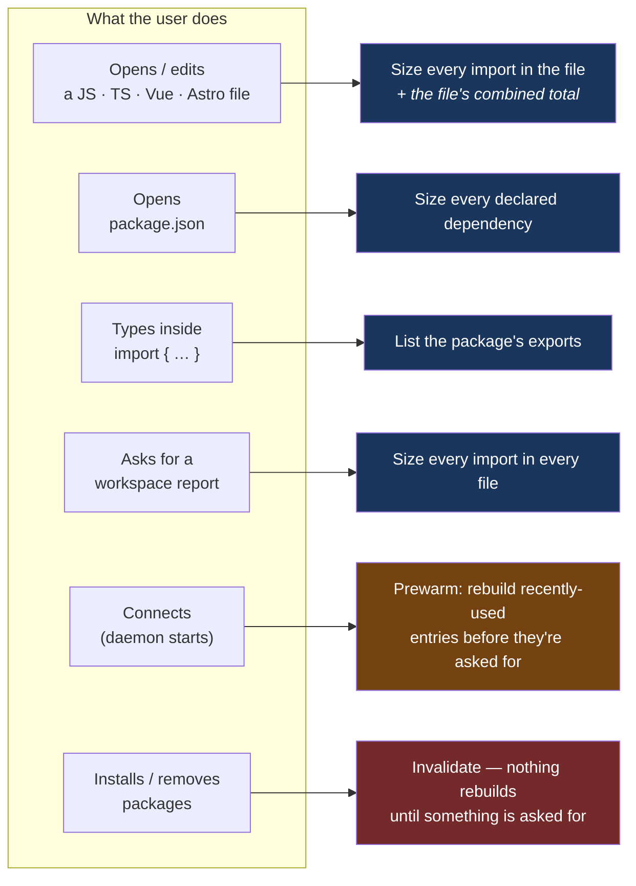
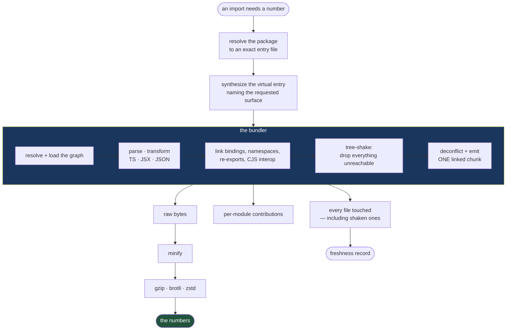
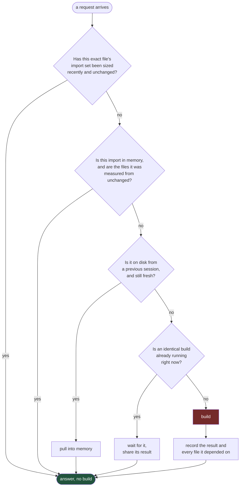
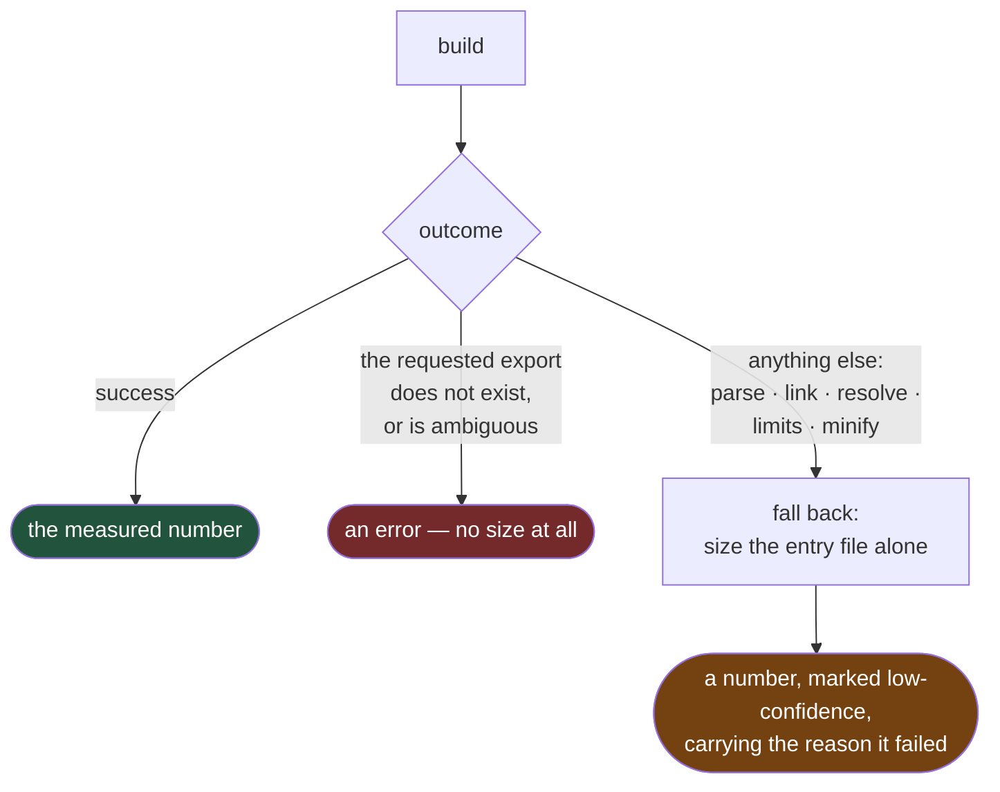

# The Import Lens Bundler

The single source of truth for how Import Lens turns an import statement into a number.

---

## 1. The question the bundler exists to answer

*How many bytes does this import actually cost?*

Not "how big is this package" — that question is easy and useless. The cost of importing one
function from a library is the size of the subgraph that function drags in: its own code, plus
every module it transitively reaches, minus everything the bundler can prove is unused, after
minification and compression.

Answering that honestly requires linking a module graph and tree-shaking it. There is no
shortcut. Summing file sizes over-counts wildly; reading the package manifest tells you
nothing; parsing the entry file alone tells you almost nothing. **The only truthful answer is
the one a real bundler produces**, which is why Import Lens contains one.

Everything else in this document follows from that single commitment.

---

## 2. The core decision: we do not implement bundling

Import Lens embeds **Rolldown** — a production Rust bundler built on the OXC compiler toolchain
— and gives it total authority over JavaScript semantics. Import Lens keeps only the work a
bundler does not do.

| Rolldown owns | Import Lens owns |
| --- | --- |
| Resolving and loading the transitive graph | Deciding *which package* the user meant |
| Linking imports, exports, re-exports, namespaces | Deciding *what to measure* |
| Interpreting `sideEffects` and deciding retention | Measuring, compressing, and reporting |
| Deconflicting symbols, emitting the linked chunk | Caching, freshness, and staying fast |
| Every question of "is this code reachable?" | Every question of "have I answered this before?" |

**Why this line, and not a little further to either side.**

Import Lens used to implement bundling itself, and it was a slow-motion disaster. The old
engine made three separate decisions — which exports are reachable, which modules to include,
which statements to emit — and nothing forced them to agree. When they disagreed, its fallbacks
converted the disagreement into *believable wrong numbers*: one path kept every import when it
couldn't tell which mattered (over-counting), another invented the name of a binding it
couldn't resolve (emitting a reference to a symbol no module declared, under-counting). One
real package under-reported by a third. The test suite passed the entire time, because it
tested individual rewriting cases rather than whether the emitted bundle was closed.

The lesson is sharp enough to be a rule: **a tool whose only output is a number may not contain
a code path that guesses.** Bundler semantics are not a feature Import Lens can own part of. It
either owns all of them and gets them right, or owns none of them. It owns none of them.

The corollary is that Import Lens must never quietly grow a second bundler. The moment
something in the product starts asking "is this statement live?" or "does this glob match?" or
"what does this re-export chain resolve to?", the old failure is back.

---

## 3. When the bundler runs

The bundler is expensive, so it runs only when something the user did makes a number
potentially wrong. Six things do that.

### Opening or editing a source file

The most common trigger. The document is parsed, every package import is extracted, and each
one is sized. This is what produces the annotation next to each import statement.

Two distinct measurements come out of it:

- **Per-import sizes** — one number per import statement, each measured independently, as if
  that import were the only thing in the file.
- **The file's combined total** — a *single* measurement of all the file's imports built
  together, so shared dependencies are counted once. Two imports that both pull in the same
  helper library cost less together than the sum of their individual numbers, and the combined
  total is the only figure that reflects that.

Editing is debounced in the editor, so a burst of keystrokes produces one analysis.

### Opening `package.json`

Every declared dependency is sized as if it were imported for its whole surface. This answers
"what am I paying for by depending on this at all", which is a different question from "what am
I paying for by importing this one function" — and it is deliberately the more pessimistic one.

### Typing inside an import's braces

Completions need the list of names a package exports. This is *not* a size measurement, but it
is still an engine build: the only trustworthy list of exports is the one the bundler resolves,
after following every re-export chain and star export. Guessing it — by walking export
statements with a hand-written parser — is exactly the class of thing that broke the old
engine.

The same list powers the "convert namespace import to named imports" action.

### The workspace report

A bulk sweep: every file, every import. It runs on a dedicated worker pool so it cannot starve
interactive work, and its cache reads are marked as bulk so a report cannot flood the recency
signal and evict the entries the user is actively working with.

### Daemon startup

Nothing the user did, but worth knowing: on connect, the daemon replays the most recently used
cache entries and rebuilds any that have gone stale, so the first file the user opens is
already warm. Any real user request cancels this instantly — prewarm never makes a user wait.

### Package installs

An install does not trigger a build. It **invalidates**, and the next request pays for the
rebuild. Rebuilding an entire dependency tree on `npm install` would be enormous, mostly
wasted, and would fight the very install that triggered it.

---

## 4. How each kind of import is handled

Every import the bundler measures is expressed as one of four *selections*. The selection
decides what the bundler is asked to keep alive, and therefore what gets measured.

| What the user wrote | Selection | What is measured |
| --- | --- | --- |
| `import { format } from "date-fns"` | **Named** | Only the subgraph `format` reaches. Everything else in the package is tree-shaken away. |
| `import React from "react"` | **Default** | The default export and its subgraph. |
| `import * as _ from "lodash"` | **Namespace** | The entire public surface — a namespace object references everything, so nothing can be shaken. |
| `await import("chart.js")` | **Full** | The entire package. A dynamic import loads the whole module, so its cost is the whole module. |
| `import "some-polyfill"` | **Namespace** | A bare import has no bindings; it is measured for its whole surface, because its purpose is its side effects. |
| `export { x } from "pkg"` | **Named** | A re-export is an import that also republishes. Measured as the named import it is. |

Some further nuances that are easy to get wrong:

- **One statement can produce two measurements.** `import React, { useState } from "react"`
  is a default import *and* a named import. They are separate rows with separate numbers,
  because they answer separate questions.
- **A named import with no names** — which can happen through some syntax paths — falls back to
  Full. When the bundler cannot tell what surface is wanted, it measures the pessimistic one.
- **Type-only imports cost nothing and are elided.** A TypeScript import whose every reference
  is in type position disappears at compile time, so it is removed before measurement rather
  than reported as zero. An import with *no* references at all is deliberately **not** elided —
  it might be there for its side effects.
- **Dynamic imports do not create a second chunk.** Code splitting is disabled, so a
  dynamically-imported dependency inlines into the single measured chunk. This is the correct
  model: the user is asking what that lazy chunk *costs*, not how the bundler would split it.

### How the bundler is told what to keep

The bundler is never handed the user's bare specifier. Import Lens has already resolved
`date-fns` to an exact file on disk — it had to, in order to know what to cache — and asking
the bundler to resolve it a second time invites two resolutions to disagree, or to pick a
different copy of the package in a nested workspace.

Instead, Import Lens synthesizes a tiny **virtual entry module** that re-exports exactly the
requested surface from the already-resolved file, and hands *that* to the bundler as the entry
point. The bundler resolves everything transitively from there, and the requested surface is
pinned alive so tree-shaking cannot remove the very thing being measured.

This is also the mechanism behind the combined file total: the virtual entry names *all* of the
document's imports at once, so the bundler sees one graph and deduplicates shared modules
naturally. Building each import separately and adding up the results would count every shared
dependency once per importer — which is the wrong number, and the reason the bundler is never
asked to build the same document's imports as independent bundles.

---

## 5. What actually happens during a build

Three things about this flow are non-obvious and load-bearing.

**The build produces exactly one chunk.** Not "usually one" — exactly one, with no extra
assets. Any other output shape is treated as a failure, because a second chunk means something
was split off and would not be counted.

**The raw and minified numbers come from the same link pass.** The bundler can minify its own
output, but asking it to would mean linking the graph *twice* — once to get the unminified
chunk, once to get the minified one — doubling the cost and risking the two measurements
observing different states of the filesystem. Instead the bundler emits one unminified chunk,
and Import Lens minifies that chunk itself with OXC's minifier. Compression then runs over the
minified string, never the raw one.

**Every file the graph touched is recorded — including the ones tree-shaken away.** This looks
like waste and is the opposite. Editing a module that was *excluded* from the last build can
change what gets included in the next one: it can change an export, add a side effect, or break
a re-export chain. A cache entry that only tracked the modules it rendered would happily serve
a stale number forever after such an edit. In practice this gap is large — one common package
loads three hundred files to render thirty-six.

### Limits

A build is bounded, because a pathological package must not be able to exhaust the machine:
a ceiling on module count, on any single module's size, and on the total source loaded. An
oversized module is rejected *before* it is read — reading it first would blow the very bound
being enforced. A breach is a clean, typed failure, never a crash and never a partial graph.

---

## 6. The numbers, and where they come from

| Reported | What it means |
| --- | --- |
| **Raw** | The linked chunk, unminified. The honest "this is the code you're pulling in". |
| **Minified** | That chunk through a real minifier. |
| **Gzip / Brotli / Zstd** | The minified string, compressed three ways. This is what actually crosses the wire. |
| **Module breakdown** | Which modules contributed the most bytes — the top handful, so a user can see *why* an import is expensive. |
| **Shared bytes** | Of this import's cost, how much is shared with *other* imports in the same file. A dependency two imports both use is not free, but it is not paid for twice either. |
| **Truly tree-shakeable** | Whether importing one name is meaningfully cheaper than importing the whole package. |
| **Confidence** | Whether the number is fully trustworthy, or was produced with a caveat. |

**Per-module contributions are approximate, on purpose.** They are measured before the final
minification pass, and the chunk's glue code belongs to no single module — so the parts do not
sum to the whole and are not required to. They exist to answer "what is making this big", not
to be re-added. Scaling them to force them to sum would be inventing precision that does not
exist.

**"Truly tree-shakeable" costs a second build.** To know whether pulling one export is cheaper
than pulling everything, you have to know what everything costs — so the package is built a
second time at its full surface, and the two are compared. This is expensive, so it is skipped
where it cannot be meaningful (a package that declares side effects, or an import that already
takes the whole surface), and the full-package result is remembered per package rather than per
import — otherwise ten different named imports from one library would each pay for their own
identical full build.

**Confidence is a first-class output, not a footnote.** When the bundler emits a warning, when
a package's side-effect declaration prevents a clean answer, or when a build failed and the
number came from a fallback, the user is told. A number that quietly hides its own uncertainty
is worse than no number.

---

## 7. How rebuilding is avoided

A build is the most expensive thing the product does. Almost every request could have been
answered without one. The entire performance story is layers of "have I already answered this?"

Each layer answers a different kind of repetition:

- **The document layer** catches the same file being re-analyzed while nothing in it changed —
  the overwhelmingly common case, since the editor asks again on every pause in typing.
- **The memory layer** catches the same import appearing in a different file, or the same file
  after an unrelated edit.
- **The disk layer** catches the same import across daemon restarts and across sessions. It is
  what makes reopening a project fast rather than a stampede.
- **Single-flight** catches the same import being requested twice *simultaneously* — a file with
  the same package imported in two statements, or two files opened at once. Only one build runs;
  the rest wait for it.
- **The side-build memos** catch the repeated work *inside* a build path: the full-package
  comparison and the export list are per-package facts, not per-import ones, so they are
  remembered per package.

And the things that avoid a build without any cache at all:

- **Cache hits never queue behind builds.** Hits are resolved on the full-width worker pool, in
  parallel, and never take a build slot. A file where nine of ten imports are cached does not
  wait on the tenth.
- **Prewarm runs before the user asks**, and is abandoned the instant they do.
- **Stale-while-revalidate** serves a known-stale number immediately, then quietly pushes the
  corrected one when the rebuild lands. A user staring at a file gets an instant answer that may
  be slightly out of date, rather than a spinner that is precisely correct.

### Concurrency: two bounds that are easy to confuse

Two builds may run at once. That number bounds **peak memory** — a build holds an entire module
graph in RAM, and the daemon shares a machine with the editor.

Each running build, however, may use most of the machine's cores, because the bundler
parallelizes *within* a build. These are different bounds and conflating them was a real bug:
the build's thread pool was once sized to the build *concurrency* limit, which pinned every
build to two threads no matter how many cores existed. Separating them made real-package builds
substantially faster without changing memory usage at all.

---

## 8. Freshness: knowing when an answer went wrong

A cached number is only valuable if it is *provably* still correct. Every cached result carries
the identity of every file it was measured from, and a request re-verifies them before serving.

**The identity of a cached answer** includes the package, its version, the exact resolved entry
file, the runtime it was resolved for, what kind of import it was, and — for a named import —
which names were requested. It also includes an **analyzer revision**: a marker that is bumped
whenever a change to Import Lens could move a reported number. Every stored entry records the
revision it was computed under and is rejected if that revision no longer matches. It is the
one thing standing between a user and a number produced by code that no longer exists. Changing
how a size is measured without bumping it is the most dangerous mistake available in this
codebase.

**Verification is split by who can change the file.**

- **Installed dependencies** are verified cheaply — size and modification time. Files inside a
  package do not change without an install, and an install invalidates everything anyway. Paying
  to re-read and hash hundreds of dependency files on every keystroke would be absurd.
- **First-party files** are verified strictly: re-read and re-hashed, every time. They change
  constantly, and a modification timestamp is not trustworthy for a file the user is actively
  editing.

**The bytes are fingerprinted at the moment they are read, during the build itself** — not
afterwards. This is subtle and it matters. If a file is edited *while* a build is running, and
the fingerprint were taken afterwards by re-reading from disk, the cache would store the NEW
file's hash against a size measured from the OLD file's contents. Every future check would then
compare the file against a hash it matches, conclude "fresh", and serve that wrong number
forever — the entry could never heal. Hashing during the read closes the window: the
fingerprint always describes exactly the bytes that were measured.

**A file that cannot be read is not the same as a file that changed.** A transient failure —
a locked file, a directory being rewritten by an installer — is treated as *unknown*, not as
stale. Unknown declines to serve the cached answer, but does not throw it away, and does not
trigger a rebuild against a filesystem that is mid-flight.

---

## 9. When the build fails

It will. Packages ship broken syntax, unresolvable optional dependencies, and graphs that blow
every reasonable limit. The rule is that **failure degrades, and never fabricates.**

The asymmetry is the whole point.

A **missing or ambiguous export** means the user asked for a name the package does not provide.
Producing a size there would paper over a real mistake in their code, so it is reported as an
error with no size at all. This is the one place the product refuses to answer, and it refuses
deliberately.

**Everything else** falls back to measuring the entry file on its own — a real number, a
drastic under-estimate, and clearly marked as such: low confidence, plus the stage that failed.
The user sees that something went wrong and roughly how much code is involved, rather than a
spinner or a lie.

No failure path may invent a symbol, measure a half-linked graph, or silently substitute an
unvalidated result.

---

## 10. Trade-offs taken deliberately

The decisions most likely to look like bugs to someone who wasn't there.

**Contributions don't sum to the total.** Measured before final minification, and chunk glue
belongs to no module. Approximate by construction. (§6)

**The whole-file compressed total is a lower bound when a file mixes runtimes.** A file that
imports both client and server code must be built once per runtime, because the two resolve
dependencies under genuinely different conditions. Those results are then compressed together,
which means an identifier appearing in both is not compressed twice. The alternative — reporting
two totals, or compressing separately and adding — is more confusing and no more true.

**A namespace import is measured at full weight, with no attempt to be clever.** A namespace
object can be indexed dynamically, so nothing in the package can be proven dead. Some bundlers
optimize the easy cases; Import Lens reports the honest ceiling.

**A CommonJS package reports only a default export when its exports are listed.** Named access
to a CJS package works — it goes through interop at link time, and its size measures correctly
— but the *list* of names cannot be recovered from the bundler's output. Import Lens reports
what the bundler resolved and does not synthesize the missing names. A guessed export list is
exactly the failure that killed the old engine, and it is not worth reintroducing for a
completion popup.

**A package that declares side effects is treated pessimistically.** If a package says its
modules have side effects, tree-shaking cannot safely remove them, and the product says so
rather than quietly reporting the optimistic number.

**Installs invalidate rather than rebuild.** Cheap, correct, and it does not fight the install.

**Depending on Rolldown's Rust API is a known, contained risk.** That API carries no stability
guarantee — it can change without warning between releases. The containment is: exact version
pins on the bundler and the entire compiler stack beneath it, a recorded fingerprint of the
whole resolved dependency graph that CI checks on every change, a locked dependency file that
only an explicit upgrade command may rewrite, and a single narrow adapter that is the only
place in the codebase permitted to name a bundler type. An upgrade must re-run the full
correctness, performance, and memory qualification.

The price paid for that dependency, stated plainly: **the compiler toolchain can no longer be
upgraded independently.** The bundler pins the compiler versions it was built against, so the
whole stack moves together, on the bundler's release cadence, or not at all. This was accepted
knowingly — it is the cost of not owning bundler semantics, and it is a bargain.

---

## 11. The invariants

If you change the bundler, these are the things that must remain true. Most of them exist
because they were once false.

1. **Bundler semantics are never reimplemented.** Not reachability, not side-effect
   classification, not binding, not liveness, not interop, not renaming. If the product starts
   asking a semantic question, it has already gone wrong.
2. **No bundler type escapes the adapter.** Nothing public and nothing persisted may contain
   one, or an upstream API change becomes a product-wide change.
3. **A build produces exactly one complete, parseable chunk** — or it is a failure.
4. **Every file the graph touched is remembered, including the tree-shaken ones**, or freshness
   is a lie.
5. **Bytes are fingerprinted as they are read**, never afterwards.
6. **The analyzer revision is bumped whenever a change can move a number.**
7. **A cache hit never waits for a build.**
8. **No failure path fabricates a symbol or measures partial code.**
9. **The bundler is never asked to build the same document's imports as separate bundles** —
   shared dependencies must be deduplicated by the bundler, not estimated afterwards.

---

## 12. What it costs, in practice

Representative measurements from real packages:

| Import | Bytes reported | Modules rendered | Files loaded |
| --- | ---: | ---: | ---: |
| One parser export from a CSS toolkit | ~320 KB | 123 | 128 |
| One formatter from a date library | ~76 KB | 36 | **304** |
| One hook from React | ~54 KB | 3 | 3 |
| One function from a CJS utility library | ~489 KB | 1 | 1 |
| One function from its ESM twin | ~12 KB | 14 | **640** |

Two things worth reading twice.

**The date library loads 304 files and renders 36.** That gap is tree-shaking doing its job —
and every one of those 268 discarded files is still tracked for freshness, because editing one
could change what survives next time.

**The same function costs 489 KB from the CommonJS build and 12 KB from the ESM build.** CommonJS
cannot be tree-shaken; the whole library comes along. Surfacing that difference, in the editor,
before the code is written, is the entire reason this product exists.

Interactively, a cold build of a large package lands in tens of milliseconds; a cached answer is
effectively instant; and a full document of imports stays well inside the memory budget the
daemon is allowed to occupy while sharing a machine with the editor.
